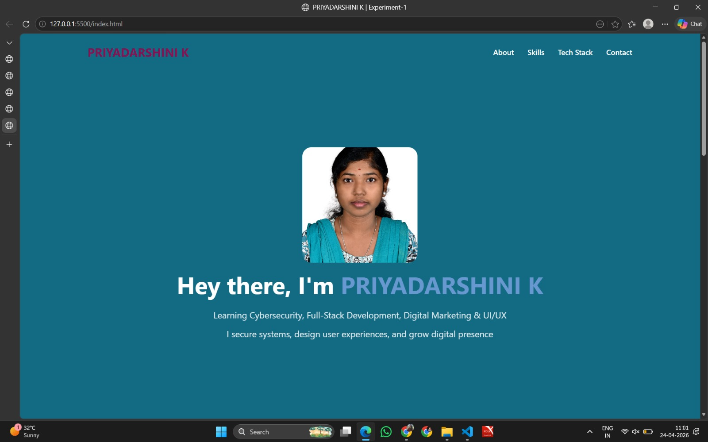
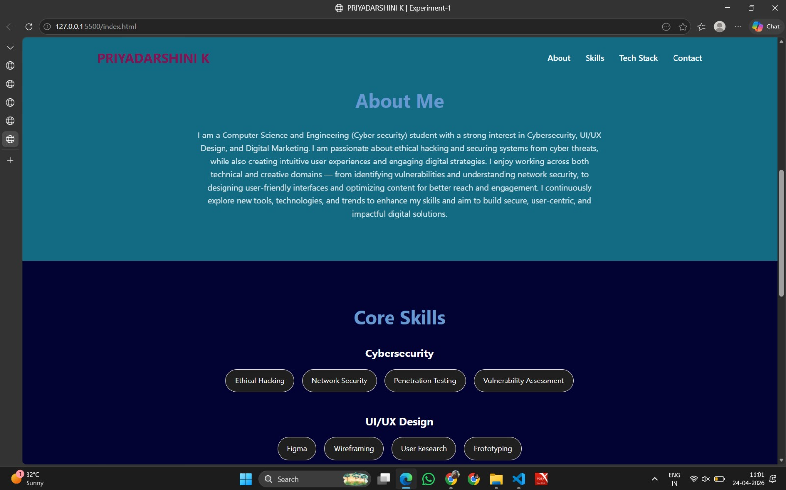
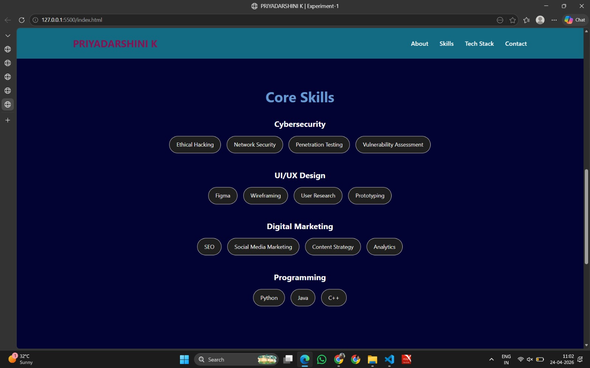
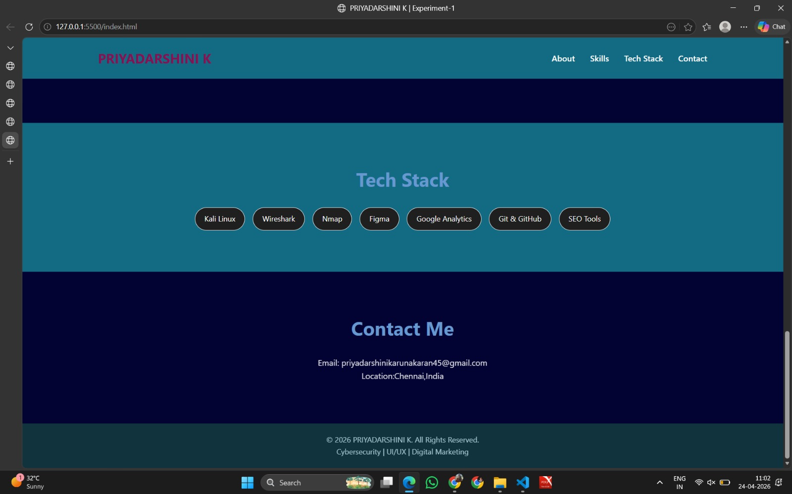

# Ex01 Portfolio
## Date:24-04-2026
## Name:PRIYADARSHINI K

## AIM
To create a Portfolio using HTML and CSS.

## ALGORITHM
### STEP 1
Create an HTML file (index.html)

### STEP 2
Create a CSS file (style.css)

### STEP 3
Include a navigation bar with links to different sections.

### STEP 4
Add structured sections for introduction, about, projects, and contact details.

### STEP 5
Define global styles for fonts, colors, and layout.

### STEP 6
Style the header, navigation bar, and sections.

### STEP 7
Use Flexbox or CSS Grid for layout design.

### STEP 8
Add hover effects and transitions for interactivity.

### STEP 9
Add Images and Media.

### STEP 10
Use optimized images for a professional look.

### STEP 11
Open the HTML file in a browser to check layout and functionality.

### STEP 12
Fix styling issues and refine content placement.

### STEP 13
Deploy the Portfolio.

### STEP 14
Upload to GitHub Pages for free hosting.

## PROGRAM
## index.html
```
<!DOCTYPE html>
<html lang="en">
<head>
  <meta charset="UTF-8">
  <meta name="viewport" content="width=device-width, initial-scale=1.0">
  <title>PRIYADARSHINI K | Experiment-1</title>
  <link rel="stylesheet" href="style.css">
</head>
<body>

  <!-- Navbar -->
  <header>
    <h1 class="logo">PRIYADARSHINI K</h1>
    <nav>
      <a href="#about">About</a>
      <a href="#skills">Skills</a>
      <a href="#tech">Tech Stack</a>
      <a href="#contact">Contact</a>
    </nav>
  </header>

  <!-- Hero Section -->
  <section class="hero">
    <div class="hero-content">
        <div class="hero-text">
          <div class="hero-image">
            
          </div>
        <h2>Hey there, I'm <span>PRIYADARSHINI K</span></h2>
        <p>Learning Cybersecurity, Full-Stack Development, Digital Marketing & UI/UX  </p>
        <p class="tagline">I secure systems, design user experiences, and grow digital presence</p>
      </div>
    </div>
  </section>

  <!-- About Section -->
  <section id="about" class="section">
    <h2>About Me</h2>
    <p>
     <p>
    I am a Computer Science and Engineering (Cyber security) student with a strong interest in Cybersecurity, UI/UX Design, and Digital Marketing. 
    I am passionate about ethical hacking and securing systems from cyber threats, while also creating intuitive user experiences and engaging digital strategies. 
    I enjoy working across both technical and creative domains — from identifying vulnerabilities and understanding network security, to designing user-friendly interfaces and optimizing content for better reach and engagement. 
    I continuously explore new tools, technologies, and trends to enhance my skills and aim to build secure, user-centric, and impactful digital solutions.
</p>
    </p>
  </section>

  <!-- Skills Section -->
  <section id="skills" class="section light">
    <h2>Core Skills</h2>

    <div class="skill-box">
  <h3>Cybersecurity</h3>
  <div class="skills">
    <span>Ethical Hacking</span>
    <span>Network Security</span>
    <span>Penetration Testing</span>
    <span>Vulnerability Assessment</span>
  </div>
</div>

<div class="skill-box">
  <h3>UI/UX Design</h3>
  <div class="skills">
    <span>Figma</span>
    <span>Wireframing</span>
    <span>User Research</span>
    <span>Prototyping</span>
  </div>
</div>

<div class="skill-box">
  <h3>Digital Marketing</h3>
  <div class="skills">
    <span>SEO</span>
    <span>Social Media Marketing</span>
    <span>Content Strategy</span>
    <span>Analytics</span>
  </div>
</div>

<div class="skill-box">
  <h3>Programming</h3>
  <div class="skills">
    <span>Python</span>
    <span>Java</span>
    <span>C++</span>
  </div>
</div>
    
  </section>

  <!-- Tech Stack Section -->
  <section id="tech" class="section">
    <h2>Tech Stack</h2>
    <div class="stack">
      <span>Kali Linux</span>
      <span>Wireshark</span>
      <span>Nmap</span>
      <span>Figma</span>
      <span>Google Analytics</span>
      <span>Git & GitHub</span>
      <span>SEO Tools</span>
    </div>
  </section>

  <!-- Contact Section -->
  <section id="contact" class="section light">
    <h2>Contact Me</h2>
    <p>Email: priyadarshinikarunakaran45@gmail.com</p>
    <p>Location:Chennai,India</p>
  </section>

  <!-- Footer -->
  <footer>
  <p>© 2026 PRIYADARSHINI K. All Rights Reserved.</p>
  <p>Cybersecurity | UI/UX | Digital Marketing</p>
</footer>
</body>
</html>
```
## style.css
```
* {
  margin: 0;
  padding: 0;
  box-sizing: border-box;
  font-family: "Segoe UI", sans-serif;
}

body {
  background: #126a83;
  color: #ffffff;
  line-height: 1.6;
}

/* Navbar */
header {
  display: flex;
  justify-content: space-between;
  align-items: center;
  padding: 20px 10%;
  background: #126a83;
  position: sticky;
  top: 0;
  z-index: 100;
}

.logo {
  color: #841353;
  font-size: 1.6rem;
}

nav a {
  margin-left: 25px;
  text-decoration: none;
  color: #fff;
  font-weight: 500;
  transition: 0.3s;
}

nav a:hover {
  color: #554e79;
}

/* Hero */
.hero {
  height: 90vh;
  display: flex;
  flex-direction: column;
  justify-content: center;
  align-items: center;
  text-align: center;
}

.hero h2 {
  font-size: 3.2rem;
}

.hero span {
  color: #6798d0;
  
}

.hero p {
  margin-top: 10px;
  font-size: 1.2rem;
  opacity: 0.85;
}

.tagline {
  margin-top: 8px;
  font-size: 1rem;
  opacity: 0.6;
}

.hero-image img {
  border-radius: 20px;
  width: 250px;
  height: 250px;
  object-fit: cover;
}

/* Sections */
.section {
  padding: 80px 10%;
  text-align: center;
}

.section h2 {
  font-size: 2.3rem;
  margin-bottom: 25px;
  color: #6798d0;

}

.section p {
  max-width: 800px;
  margin: auto;
  opacity: 0.85;
}

.light {
  background: #020332;
}

/* Skills */
.skill-box {
  margin-bottom: 40px;
}

.skill-box h3 {
  margin-bottom: 15px;
  color: #fff;
  font-size: 1.3rem;
}

.skills, .stack {
  display: flex;
  flex-wrap: wrap;
  justify-content: center;
  gap: 15px;
}

.skills span {
  background: #1f1f1f;
  border: 1px solid #ece3e3;
  color: #fff;
  padding: 10px 18px;
  border-radius: 25px;
  font-size: 0.9rem;
  transition: 0.3s;
}

.skills span:hover {
  background: #447fd1;
  transform: translateY(-3px);
}

/* Tech Stack */
.stack span {
  background: #1f1f1f;
  border: 1px solid #f8f1f1;
  color: #fff;
  padding: 10px 18px;
  border-radius: 25px;
  font-size: 0.9rem;
  transition: 0.3s;
}

.stack span:hover {
  background: #3766a9;
  transform: translateY(-3px);
}

.mern {
  border: 1px solid #ff3c3c !important;
  color: #ff3c3c;
  font-weight: 600;
}

/* Footer */
footer {
  background: #0f0f0f;
  padding: 20px;
  text-align: center;
  font-size: 0.9rem;
  opacity: 0.6;
}
```


## OUTPUT






## RESULT
The program for creating Portfolio using HTML and CSS is executed successfully.
